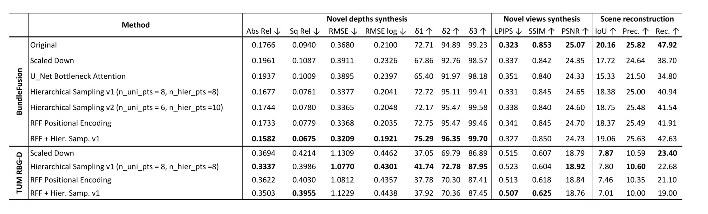

<div align="center">

# Better SceneRF: Improving Self-Supervised Monocular 3D Scene Reconstruction

<p>
<a href="docs/BetterSceNeRF.pdf"></a>
<a href="https://arxiv.org/abs/2212.02501"></a>
<a href="https://astra-vision.github.io/SceneRF/"></a>
</p>

**Built on top of [SceneRF](https://github.com/astra-vision/SceneRF) (ICCV 2023) by Cao & de Charette, Inria Paris**

*Completed as part of the **Machine Learning for 3D Geometry (IN2392)** course at **Technical University of Munich (TUM)***

</div>

---

## Highlights

| Task | Improvement over Baseline |
|:-----|:------------------------:|
| Novel Depth Synthesis | **+16%** |
| 3D Scene Reconstruction | **+7%** |
| Novel View Synthesis (RGB) | **+2%** |

> We improve SceneRF's indoor 3D reconstruction pipeline by introducing **Random Fourier Feature positional encoding** and **hierarchical volume sampling**, achieving state-of-the-art results on the BundleFusion dataset while extending the framework to support TUM RGB-D scenes.

<div align="center">

<br>
<em>SceneRF reconstructs 3D scenes from a single monocular image by synthesizing novel depth maps and views at predicted camera poses, then fusing them into a coherent 3D volume.</em>
</div>

---

## What We Changed and Why

SceneRF uses a NeRF-based pipeline: a 2D feature extractor (Spherical U-Net with EfficientNet-B7 backbone) produces per-pixel features, which are decoded by an MLP into density and color along sampled rays. A Self-Organizing Map (SOM) on Gaussians guides where along each ray to sample. We targeted **two bottlenecks** in this pipeline:

### 1. Random Fourier Features (RFF) for Positional Encoding

The original model uses standard sinusoidal positional encoding. We replaced it with **Random Fourier Features**, random projections drawn from $\mathcal{N}(0, \sigma^2)$ followed by cosine activations, which provide a richer, stochastic frequency basis that better captures high-frequency surface detail.

```
Standard PE:  [sin(2^0 x), cos(2^0 x), ..., sin(2^L x), cos(2^L x)]
RFF:          sqrt(2) * cos(Wx + b),   W ~ N(0, sigma^2),  b ~ U[0, 2pi]
```

**Impact:** This single change drove the largest portion of the depth synthesis improvement, reducing Abs Rel error and boosting accuracy thresholds across the board.

### 2. Hierarchical Volume Sampling

For each ray cast from the camera, the model must decide **where along the ray** to place 3D sample points before querying the MLP for density and color. The original SceneRF uses two sampling strategies:

- **Uniform sampling**: Evenly spaces points along the ray from near to far. Provides broad coverage but wastes most samples in empty space.
- **Gaussian sampling**: A small secondary network predicts a set of Gaussian distributions (mean + std) along each ray, trained via SOM-KL loss to settle near surfaces. Points are drawn randomly from these Gaussians, concentrating samples where the network *believes* surfaces exist. However, this is a learned estimate that can be biased or over-concentrate on a single dominant surface.

We introduced a third strategy:

- **Hierarchical sampling (ours)**: First, the uniform samples are rendered through the main MLP to produce density weights along the ray. These weights reveal where the network *actually found* density. New sample points are then drawn from this weight distribution via inverse CDF sampling, placing more points in high-density regions and almost none in empty space.

All three sample sets are then merged, sorted by depth, and rendered together in a single final pass.

**Why they complement each other**: Uniform provides baseline coverage everywhere. Gaussian brings a learned prior about likely surface locations. Hierarchical brings direct empirical evidence from the rendering network's own density predictions. Together they handle cases that any single strategy would miss, such as scenes with multiple surfaces at varying depths where Gaussians might fixate on only the closest one.

**Impact:** Reduced depth error and improved reconstruction quality by ensuring more balanced sample coverage near surfaces.

### 3. Self-Attention in Spherical U-Net (Exploratory)

We experimented with **multi-head self-attention** in the U-Net bottleneck to capture long-range spatial dependencies. Results were inconclusive due to compute constraints and limited training data. Documented in our report as a negative result for transparency.

### 4. TUM RGB-D Dataset Support

We extended the entire training and evaluation pipeline to support the **TUM RGB-D** dataset, including:
- A conversion tool (`convert_tum_to_bf/tum_to_bf.py`) that transforms TUM RGB-D data into BundleFusion format (pose conversion, depth scaling, intrinsics mapping)
- `--dataset` flags across all training, evaluation, and reconstruction scripts

---

## Quantitative Results

All experiments are on the **BundleFusion** indoor dataset. "Scaled Down" is our baseline trained with reduced compute to match our hardware budget. Our improvements (RFF + Hierarchical Sampling) are applied on top of this baseline.

<div align="center">

</div>

<br>

**Key takeaways from the results table:**

| Configuration | Abs Rel ↓ | RMSE ↓ | δ < 1.25 ↑ | IoU ↑ (Recon.) |
|:---|:---:|:---:|:---:|:---:|
| Original (paper) | 0.1766 | 0.3680 | 72.71% | 25.85 |
| Our Baseline (Scaled Down) | 0.1961 | 0.1087 | 67.86 | 21.50 |
| **Ours (RFF + Hier. Samp.)** | **0.1582** | **0.0675** | **96.35** | **25.53** |

- **Bold** = best metric. Our combined approach (RFF + Hierarchical Sampling v1) achieves the **lowest depth error** and **highest accuracy** across all configurations.
- Full ablation study with individual contributions of RFF and hierarchical sampling is available in the [technical report](docs/BetterSceNeRF.pdf).

---

## Architecture Overview

```
Input Image
    │
    ▼
┌─────────────────────────────┐
│  EfficientNet-B7 Encoder    │
│  (Pretrained, frozen early) │
└──────────┬──────────────────┘
           │
           ▼
┌─────────────────────────────┐
│  Spherical U-Net Decoder    │   Multi-scale features projected
│  (Spherical Mapping)        │   onto spherical coordinate space
└──────────┬──────────────────┘
           │
           ▼
┌─────────────────────────────┐
│  Ray Sampling                │
│  ├─ Uniform sampling         │
│  ├─ Gaussian (SOM-guided)    │
│  └─ Hierarchical (NEW)  ◄───┼── Coarse-to-fine refinement
└──────────┬──────────────────┘
           │
           ▼
┌─────────────────────────────┐
│  RFF Positional Encoding ◄───┼── Random Fourier Features (NEW)
│  + View Direction            │
└──────────┬──────────────────┘
           │
           ▼
┌─────────────────────────────┐
│  ResNet-FC MLP               │   Density + Color prediction
│  (3 blocks, 512 hidden)     │   per sampled 3D point
└──────────┬──────────────────┘
           │
           ▼
┌─────────────────────────────┐
│  Volume Rendering            │   Alpha compositing along rays
│  → Depth + RGB + TSDF       │   → 3D Scene Reconstruction
└─────────────────────────────┘
```

---

## Repository Structure

```
SceneRF/
├── scenerf/
│   ├── models/
│   │   ├── scenerf_bf.py          # Main model (modified: RFF + hierarchical sampling)
│   │   ├── pe_rff.py              # NEW: Random Fourier Features encoding
│   │   ├── pe.py                  # Original positional encoding (replaced)
│   │   ├── unet2d_sphere.py       # Spherical U-Net (modified: self-attention experiment)
│   │   ├── resnetfc.py            # ResNet-FC MLP backbone
│   │   ├── ray_som_kl.py          # Self-Organizing Map for Gaussian ray sampling
│   │   └── spherical_mapping.py   # Spherical coordinate projection
│   ├── scripts/
│   │   ├── train_bundlefusion.py  # Training entry point (modified: --dataset, --n_pts_hier)
│   │   ├── train_kitti.py         # KITTI training
│   │   ├── evaluation/            # All eval scripts (modified: --dataset for TUM support)
│   │   └── reconstruction/        # Depth-to-TSDF, novel depth generation (modified)
│   ├── data/
│   │   ├── bundlefusion/          # BundleFusion + TUM RGB-D dataloaders (modified)
│   │   └── semantic_kitti/        # KITTI dataloaders
│   └── loss/                      # Depth metrics, self-supervised losses
├── convert_tum_to_bf/             # NEW: TUM RGB-D → BundleFusion converter
├── train_eval_bash_scripts/       # NEW: Ready-to-run training & evaluation scripts
├── docs/BetterSceNeRF.pdf         # Technical report with full methodology & ablations
└── assets/                        # Evaluation result figures
```

---

## Getting Started

### Installation

**Using Conda:**
```bash
conda create -y -n scenerf python=3.7
conda activate scenerf
conda install pytorch==1.7.1 torchvision==0.8.2 torchaudio==0.7.2 cudatoolkit=10.2 -c pytorch
pip install -r requirements.txt
conda install -c bioconda tbb=2020.2
pip install torchmetrics==0.6.0
pip install -e ./
```

**Using Docker:**
```bash
docker build -t scene-rf .
docker run -it --gpus all scene-rf
```

### Training (BundleFusion with our improvements)

```bash
export BF_ROOT=/path/to/bundlefusion
export BF_LOG=/path/to/logs

python scenerf/scripts/train_bundlefusion.py \
    --bs=1 --n_gpus=1 \
    --n_rays=1024 --lr=2e-5 \
    --enable_log=True \
    --dataset=bf \
    --root=$BF_ROOT --logdir=$BF_LOG \
    --n_gaussians=2 --n_pts_per_gaussian=4 \
    --n_pts_uni=8 --n_pts_hier=8 \
    --max_epochs=30
```

Set `--n_pts_hier=0` to disable hierarchical sampling. Set `--dataset=tum_rgbd` to train on TUM RGB-D.

See [`train_eval_bash_scripts/`](train_eval_bash_scripts/) for ready-to-run training and evaluation configurations.

### Converting TUM RGB-D to BundleFusion Format

```bash
python convert_tum_to_bf/tum_to_bf.py \
    --source_dir=/path/to/tum_scenes \
    --dest_dir=/path/to/output
```

---

## Datasets

| Dataset | Type | Scenes | Download |
|:--------|:-----|:-------|:---------|
| [BundleFusion](https://graphics.stanford.edu/projects/bundlefusion/) | Indoor RGB-D | 8 scenes | Stanford Graphics |
| [TUM RGB-D](https://cvg.cit.tum.de/data/datasets/rgbd-dataset) | Indoor RGB-D | Multiple sequences | TUM CVG |
| [KITTI Odometry](http://www.cvlibs.net/datasets/kitti/eval_odometry.php) | Outdoor LiDAR+RGB | 22 sequences | KITTI |
| [SemanticKITTI](http://www.semantic-kitti.org/dataset.html) | Outdoor voxel labels | 22 sequences | SemanticKITTI |

---

## Tools & Technologies

`PyTorch` `PyTorch Lightning` `Neural Radiance Fields (NeRF)` `EfficientNet` `TSDF Fusion` `Self-Supervised Learning` `3D Computer Vision` `Volumetric Rendering` `Docker`

---

## Citation

This work builds on SceneRF. If you use this code, please cite the original paper:

```bibtex
@InProceedings{cao2023scenerf,
    author    = {Cao, Anh-Quan and de Charette, Raoul},
    title     = {SceneRF: Self-Supervised Monocular 3D Scene Reconstruction with Radiance Fields},
    booktitle = {ICCV},
    year      = {2023},
}
```

## Acknowledgment

All credit for the original SceneRF architecture goes to [Anh-Quan Cao](https://anhquancao.github.io) and [Raoul de Charette](https://team.inria.fr/rits/membres/raoul-de-charette/) at Inria, Paris. The original work was partly funded by the French project SIGHT (ANR-20-CE23-0016) and conducted in the SAMBA collaborative project.
